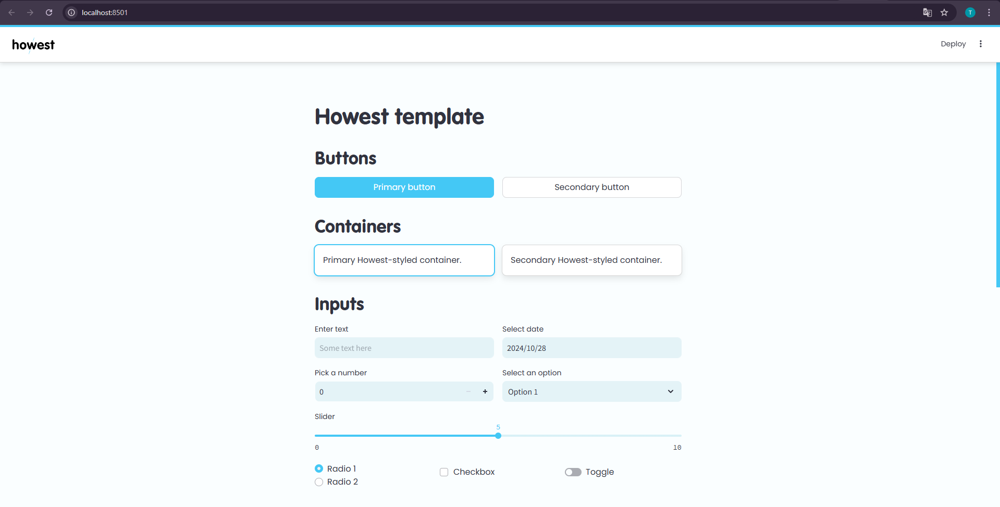
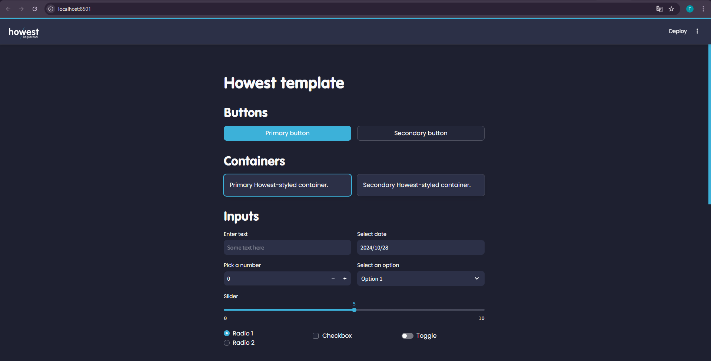
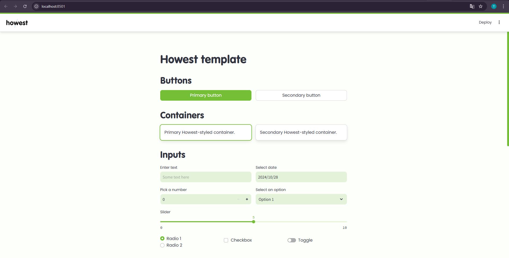
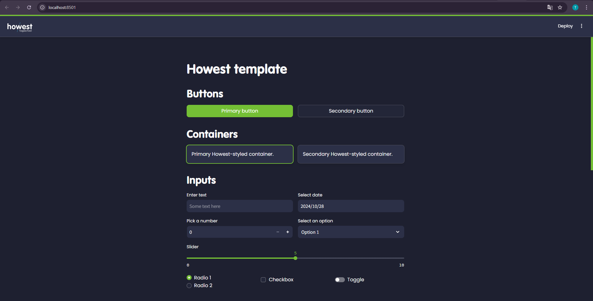

# Streamlit Howest Devcontainer Template

This is a Streamlit project template to quickly develop a Howest-themed app using Python.
It is perfect for AI projects and building graphical interfaces for existing projects.

## Devcontainer setup

1. Create a new repository using this GitHub template.
2. Clone the repository and open it using VSCode.
3. Run `python .devcontainer/change_gpu_config.py` to select your GPU mode.
4. Press `Ctrl+Shift+P` to open the command palette.
5. Search for `Dev Containers: Rebuild and Reopen in Container`.
6. Follow the instructions in the terminal.
7. An example Streamlit webapp should run automatically, navigate to [http://localhost:8501/](http://localhost:8501/)

## Getting started

There are 4 different Howest color schemes you can choose from:

|                  | Light mode                                                      | Dark mode                                                     |
| ---------------- | --------------------------------------------------------------- | ------------------------------------------------------------- |
| Howest Blue      |    |    |
| Energy Lab Green |  |  |

To **change the color config**, execute the following command:

```bash
python .streamlit/change_streamlit_config.py
```

> [!TIP]
> You can also pass CLI arguments to this script. Append `--help` to learn more.

To **run your app**, execute the following command:
```bash
streamlit run app.py
```

There's also a small example app present to showcase the usage of some common elements.<br>
To **run the example app**, execute the following command:
```bash
streamlit run example.py
```

## Possible errors


| **❌ Error** | **✅ Solution** |
| :--- | :--- |
| Streamlit is not recognized as a command. | Run `poetry install && poetry shell` to make sure your Poetry environment is set up and activated. |
| Running the `change_streamlit_config.py` script fails. | Run the script from the correct directory (forgot a `cd` command?). |
| inotify watch limit reached | Streamlit uses a file watcher just like Git does to detect changes. This avoids having to rerun the app after changing the code. If this file watcher limit is reached on your machine, you won't be able to use this feature. Use `streamlit run app.py --server.fileWatcherType none` to run your app without a file watcher. |